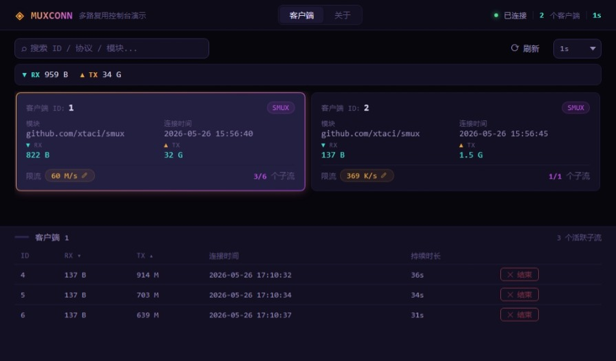

# muxconn

Go 语言流式多路复用库，将 [smux](https://github.com/xtaci/smux) 和 [yamux](https://github.com/hashicorp/yamux) 统一在同一个 `Muxer` 接口之下，开箱即用、可互换、可观测。

## 核心接口

- **`muxconn.Muxer`** — 多路复用会话，嵌入 `net.Listener`，提供 `Open()` / `Accept()` / `Close()` / `NumStreams()` / `Traffic()` 等操作
- **`muxconn.Streamer`** — 虚拟子流，嵌入 `net.Conn`，额外提供 `Stats()` 获取流级别收发统计

## 功能特性

| 特性 | 说明 |
|------|------|
| **双后端可切换** | smux 与 yamux 通过同一接口互换，支持运行时 `Library()` 识别当前后端，可互为备选或交叉验证 |
| **速率限制** | 每个 Muxer 粒度的令牌桶限速（`SetLimit`/`Limit`），所有子流共享读写配额，逐 chunk（32KB）控制 |
| **流量统计** | 按 Muxer 聚合（`Traffic()`）和按 Stream 细分（`Stats()`）的 RX/TX 字节计数，支持运行时观测 |
| **子流追踪** | `NumStreams()` 返回累计创建数 + 当前活跃数，`Streams()` 列出所有活跃子流 |
| **WebSocket 拨号** | 内置 `DialWebsocket`，支持 `ws://` / `wss://`，自动协商 smux/yamux 协议 |
| **多地址回退** | 传入多个地址时逐个尝试，全部失败后返回聚合错误 |
| **协议自动协商** | URL Query 参数 `protocol` 指定协议，未指定时自动依次尝试 smux → yamux |
| **Context 生命周期** | 基于 context 的取消传播，Parent 取消时所有子流自动关闭，支持优雅退出 |
| **连接时间戳** | `ConnectedAt()` 返回 Muxer 创建时间，便于排查长连接老化问题 |

## 使用示例

[github.com/xmx/muxconn-example](https://github.com/xmx/muxconn-example)

